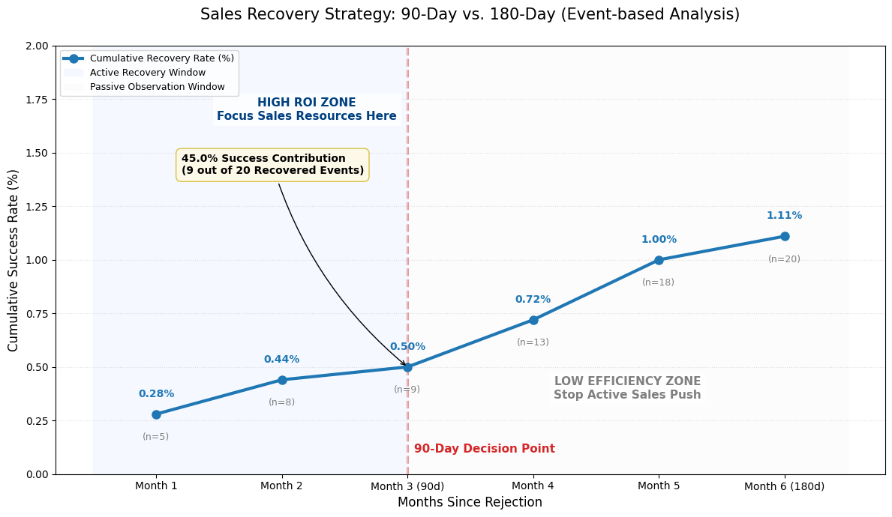
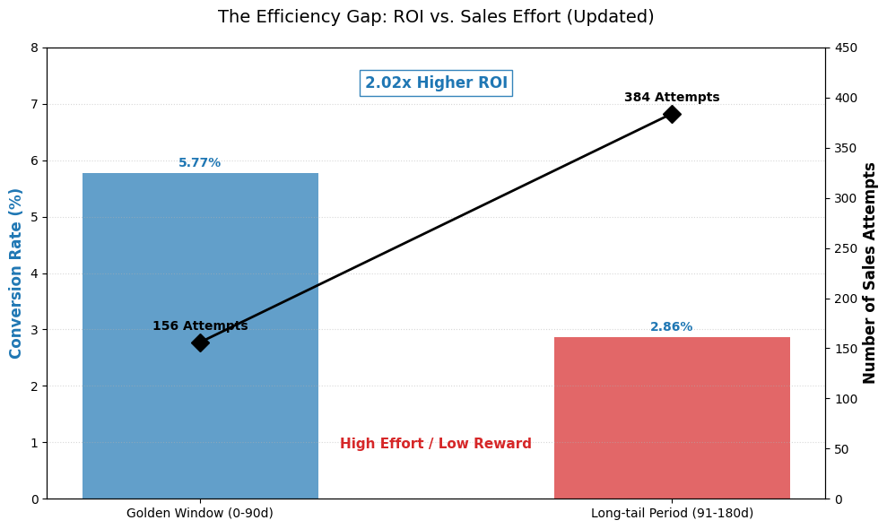
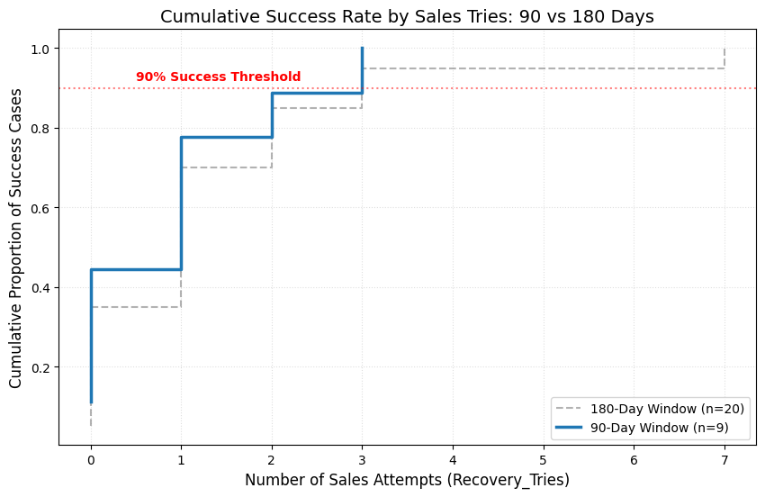
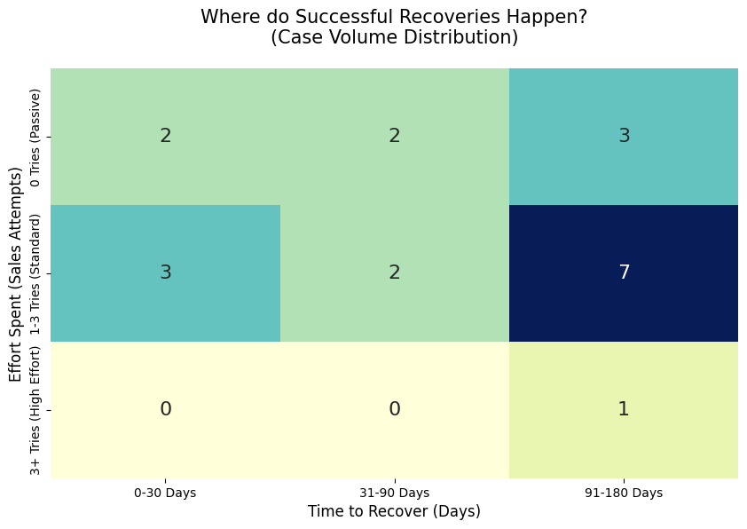

# Client Project Sales Activities Analytics
### **Real-World Business Scenario**
This project was provided by a **real job search and recruitment platform in Hong Kong**. The analysis was performed on a dataset of **31,874 historical activity logs** to solve real-world sales efficiency challenges.

> **Privacy Note:** Due to data privacy and commercial confidentiality requirements, the raw dataset is restricted and cannot be made public.
---
This project was developed as a team collaboration. I was responsible for one of the project objectives which is a sales journey to determine the average duration and number of touchpoints required to close a deal. By identifying the frequency of interactions before a deal is abandoned, these insights will define a data-driven threshold for "giving up", helping the team refine resource allocation and improve sales efficiency. 

## Methodology: Data Refinement and Metric Calibration
To ensure the integrity of the analysis, I addressed the absence of distinct indicators in the raw logs:

* *Keyword-based Categorization:* Performed a deep-dive analysis of message content, identifying the*60 most frequent keywords* to Split logs into Sales Attempts (e.g., 'package', 'quote') and Post-Sales/Admin.

* *Success Path Calibration:* Focused exclusively on companies that signed deals, tracking journeys via unique Company IDs to measure attempts and duration.

* *The 180-Day Sales Cycle:* Established a *180-day window* to ensure metrics accurately reflect direct sales influence rather than external client triggers.

* *Recovery Definition:* Verified *20 recovery cases* (previously marked "Rejected" that later reached "Signed" status) for detailed analysis.

## Key Insights: The 90-Day Golden Window and ROI
Analysis of the verified recoveries revealed that conversion efficiency is dramatically higher in the early stages:

* *The High ROI Zone (Day 0-90):* *45%* of total recoveries were achieved within the *first 90 days*. The ROI Peak (cumulative success rate) reaches maximum efficiency at the *first 3-month*.

* *Efficiency Gap Analysis:* The Golden Window (Day 0-90) achieved a *5.77% conversion rate*, whereas the Long-tail Period (Day 91-180) *dropped to 2.86%* despite consuming *71% of total sales effort*.

* Finding: The early stage offers *2.02x higher ROI.* Sustaining high effort beyond *90 days* does not justify the associated labor costs.

  
Click to view 90-Day Golden window and ROI 

   
  
  

## The "Magic Number" of Attempts
By analyzing the volume of effort, I identified a definitive threshold for recovery:

* *The 3rd Attempt Threshold:* *100%* of successful recoveries in the *90-day window* were captured within just *3 sales attempts*.

* Finding: If a client intends to sign, they typically do so early. Excessive persistence beyond the *3rd attempt* shows diminishing returns.

  
Click to view Success Rate by Sales Tries 

   
  

## Recovery Matrix and Strategic Summary
* Developed a Heatmap crossing Time with Sales Effort to provide a strategic roadmap:

* Low Effort "Sweet Spot": Confirms that in the first 90 days, *timing is a more powerful driver than persistence.*

* Passive Success: *35%* of recoveries occurred with *ZERO* sales attempts, proving the impact of staying "top-of-mind" with the customer.

  
Click to view a Heatmap 

   
  

## Quick Links

* [**Presentation Slides My Contributions ONLY (PDF)**](./Client_Project_Mypart.pdf) — *Focuses exclusively on my contributions*
* [**Read Project Report (PDF)**](./Client_Project_Report.pdf)
* [**Presentation Slides FULL (PDF)**](./Client_Project_FullPPT.pdf) — *The full version of Presentation Slides*
> **Privacy Note:** Due to data privacy and commercial confidentiality requirements, the raw dataset is restricted and cannot be made public.
